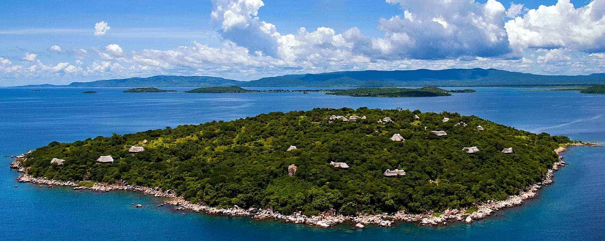

# Tanzania Water
Flatiron Mod 3 Project

## Overview


### Repository Navigation
- [Data Folder Includes](Data)
    - [Data from Taarifa on datadriven.org](https://www.drivendata.org/competitions/7/pump-it-up-data-mining-the-water-table/data/)
        - [Training Set Labels](Data/training_set_labels.csv)
        - [Training Set Values](Data/training_set_values.csv)
        - [Test Set Values](Data/test_set_values.csv)
    - Modified Datasets
        - [Combined Training Set](training_set.csv)
        - [Altitude Data](Data/looked_up_alts.csv)
        - [Cleaned Data](Data/cleaned_data_072920_shaw.csv)
        - [Preliminary Data](Data/water_well.csv)


- Notebooks: [Summary Notebook](Notebooks/Master_Notebook_2.ipynb)
    - [Exploratory Data Analysis](Notebooks/EDA_Alex.ipynb)
    - [Data Production](Notebooks/data_production_notebook.ipynb)
    - [Determine Confidence Intervals](Notebooks/Confidence_Interval_with_inputs.ipynb)
    - [Train Regression](Notebooks/Training_Regression.ipynb)
    - [Make Prediction](Notebooks/Make_Prediction.ipynb)
    - [Visualizations](Notebooks/Visualizations)

- [Presentation](Presentation/WATER.pdf) [Presentation](Presentation/WATER_presentation.ppf)


### ReadMe Navigation

1. [Business Context](#Business-Context)
2. [Current Landscape](#Data-Understanding)
    1. The problem
    2. Data Understanding
    3. Data Limitations
    
3. [Predictive Analysis](#Predictive-Analysis)
    1. [Performance Metric](Performance-Metric)
    2. [Model Selection](#Model-Selection)
    3. [Feature Importance](#Feature-Importance)
    
4. [Conclusion & Takeaways](Conclusions-and-Takeaways)
    1. Improvement Areas
    2. Growth Opportunities
    3. Takeaways

5. [Conclusions](#Conclusions)
6. [Further Steps](#Further-Steps)
7. [Project Info](#Project-Info)

***

## Business Context

Water in Africa: Technical and Equipment Researchers, LTD. (WATER) is a (hypothetical) consultancy which seeks to amplify the positive effects of progress in water point parts, supply, and maintenance. Progress may be made by the public and/or private sectors by analyzing, and anticipating the status of water point repair more quickly and efficiently.

### Predicting Water Point Maintenance Status from Data

The instrumental goal in this project is to construct a model capable of predicting the status of a waterpoint (specifically, in Tanzania), between the three states of "functional", "functional needs repair", and "non functioning".The underlying motivation is to create a cheaply implemented, readily available tool for businesses or other organizations looking to provide maintenance and replacement services for said waterpoints. This should in principle lower the overhead costs for such providers (less chance of over-ordering parts, over-hiring staff, etc.) and so should, due to lower volatility and increased profitability, stimulate the creation of new providers or expansion of new ones.

A major factor in waterpoint failure is difficulty in assessing necessary maintenance; this model would help ameliorate that. In summary, our goal was to:

**Reduce overhead costs by anticipating water pump maintenance status.**


***

### The Problem

Providing additional context, we viewed several problems: several water points need work, maintenance was costly and infrequent, and water points would stay in states of disrepair because of these costs

Our model helps to fix those problems by starting with more efficient market planning in determining resource distributions and repair/maintenance/parts necessities. Further, it should reduce volatility and increase profitability for maintenance providers. Finally, ideally it would increase the size of the pie by enabling more maintenance providers to enter the space

## Data Understanding

The data from this project came from various collection efforts in the early 2000s, with GeoData LTD. listed as the data recorder. The dataset was obtained from Taarifa and the Tanzanian Water Ministry.

Overall, the data provided included the functional status of 59,400 observations, covering features such as geography, geology, community engagement, operational habits, age, resource availability, and technical specifications of the waterpoints.

An overall map of Tanzania, with the functional, needs repair, and nonfunctional categories


The distribution of functionalities looked like this:


### Data Categories
####  Geographical
This data included politically geographical data as well as geological data about the altitudes of the water points


#### Management
Several index names covered this category: installer, scheme management, management, etc.

#### Waterpoint Specifics
These datapoints could be summarized as specific to the actual water point - names, type of extraction, quality of the water, etc.

#### Numerical, Ordinal,  Categorical
The datatypes used in these columns were of various types that would have to be considered when implementing our algorithms.

### Feature Importance
In order to make the model understandable, we extracted the features which the model determined to be most impactfully correlated with the status group, including: quantity of water available, region, payment type, source, elevation, etc.

### Data Limitations

Amongst others, the limitations on data we encountered that would impact how our model trained:

1. Multiple reporters
2. Inconsistent naming/reporting
3. Opaque Values
4. Few examples of "needs repair"
5. Clear mistakes

We "solved some of these issues by:
1. Autocorrection for typographical errors
2. Google maps data for missing elevation data
3. Filling in other missing data by the most similar attributes
                                        

***

## Predictive Analysis

### Performance Metric
When evaluating several models, we chose to use a weighted-average "Recall Score" as our performance metric. This would enable us to most accurately predict which pumps were nonfunctional or needed repair. 

###  Model Selection
We created a pipeline for our model that started with a SimpleImputer to clean values, OneHotEncoding to create numerical data out of the categoricals, and a KNN Imputer to fill in any remaining missing values. 

Then, after evaluating several classification models in scikit-learn (Logistic Regression, KNN Classifier, Decision Tree Classifier, XGBoost, Random Forest Classifier, and Naive Bayes), we settled upon DecisionTreeClassifier and RandomForests to give our most accurate recall. That resulted in the following:


In this image, the brown represents the accurately predicted nonfunctional water points, which all require maintenance, parts, etc. The red and blue represent situations in which the parts/maintenance supplier would be underprepared or overprepared in terms of resources (inefficient allocation). The green in the center was what we minimized. And the far right gray represents functional water points that we are not yet concerned with.

### Feature Importance
After running the algorithm, we determined that the model would be most effective to understand and implement for potential parts/repair/maintenance firms if they understood which factors contributed the most to the predictions, so they are listed here:


## Conclusions and Takeaways

Our objective was to reduce overhead costs by anticipating water pump maintenance status using a predictive model. In order to iteratively improve on the recall score for the model (and in turn achieve higher effectiveness) we:


Improve maintenance planning & budgeting by:

1. Using readily available categories of data
2. Applying data to our model
3. Model gives desired importance:
    1. 91% for pumps needing any maintenacne
    2. 78% for identifying level of maintenance


### Areas to Improve:

- Better computational resources
- Underlying data quality correlations
- Obtain more data for integrity control
- More sophisticated data correction
- Further feature optimization
- Informed feature engineering


### Growth Opportunities

- Cautiously investigate applicability to other areas
- Develop lifetime estimations
- Invert model to identify demand for particulars
- Combine with economic models


## ASANTE!
Or, Thank you!


## Project Info

Contributors: __[Alexander](https://www.linkedin.com/in/anewt/)__ __[Newton](https://github.com/anewt225)__, __[James](https://www.linkedin.com/in/james-shaw-848984104//)__ __[Shaw](https://github.com/godelayheehoo)__

Languages  : Python

Tools/IDE  : Git, Command Line (Windows), Anaconda, Jupyter Notebook, Google Slides

Libraries  : numpy, pandas, matplotlib, seaborn, scikit-learn, missingno, geopandas, descartes, shapely

Duration   : July 2020
Last Update: 07.31.2020


```python

```

